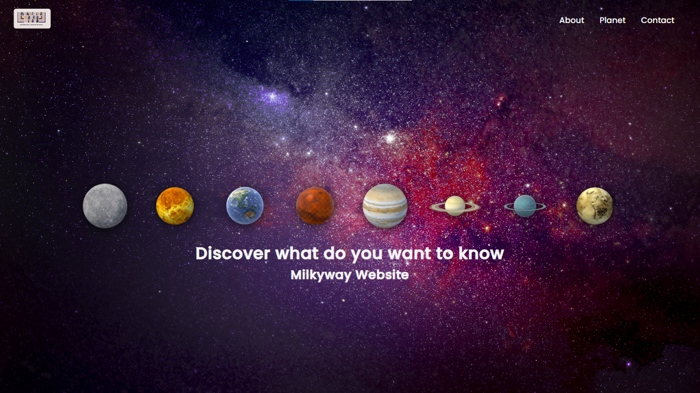

# Milky Way Explorer



Welcome to **Milky Way Explorer** – a cosmic journey through our galaxy! This repository dives into the wonders of the Milky Way, uncovering the secrets of its planets, celestial objects, and mind-blowing facts that make our galactic home truly extraordinary.

## What’s Inside?

- **Planets of the Milky Way**: Discover the known and theorized worlds orbiting stars in our galaxy.
- **Galactic Objects**: From dazzling nebulae to mysterious black holes, explore the building blocks of the Milky Way.
- **Unique Facts**: Did you know the Milky Way has a supermassive black hole at its center? Find more quirky and fascinating tidbits here!

## Why Explore the Milky Way?

The Milky Way isn’t just our address in the universe – it’s a treasure trove of cosmic phenomena waiting to be understood. Whether you're an astronomy buff or just stargazing-curious, this project is your launchpad to the stars.

## Get Started

Clone this repo and embark on your galactic adventure:

```bash
git clone https://github.com/bahartika/Milky-way.git
```
